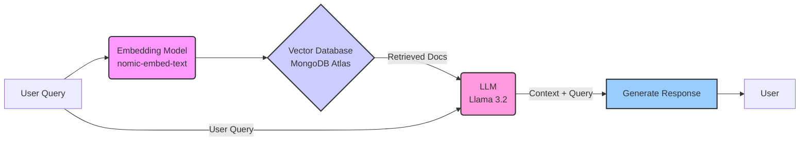

# RAG Implementation with LangChain, MongoDB Atlas, and Ollama

[](https://opensource.org/licenses/MIT)

This project implements a **Retrieval-Augmented Generation (RAG)** system using LangChain, MongoDB Atlas Vector Search, and Ollama. It enables semantic search capabilities over a dataset (e.g., Airbnb property listings) by combining vector embeddings with a large language model (LLM) for accurate and contextual responses.

## ✨ Features

*   **Vector Similarity Search**: Leverages MongoDB Atlas Vector Search for efficient retrieval of relevant documents.
*   **Document Embeddings**: Generates embeddings using Ollama's `nomic-embed-text` model.
*   **RAG Pipeline**: Implements a robust RAG pipeline using LangChain and Ollama's `llama3.2` model.
*   **Semantic Search**: Enables searching through data (like Airbnb listings) based on meaning rather than just keywords.
*   **Contextual Q&A**: Provides answers to questions based on the retrieved context from the data.

## ⚙️ Prerequisites

Before you begin, ensure you have the following installed and configured:

*   **Node.js**: (Specify version, e.g., v18 or later)
*   **npm** or **yarn**: Package manager for Node.js.
*   **MongoDB Atlas Account**: A free or paid tier account with a database cluster. Vector Search needs to be enabled/configured on your collection.
*   **Ollama**: Running locally.
    *   Install Ollama from [ollama.com](https://ollama.com/).
    *   Pull the required models:
        ```bash
        ollama pull llama3.2
        ollama pull nomic-embed-text
        ```

## 🚀 Setup

1.  **Clone the Repository**:
    ```bash
    git clone <your-repository-url>
    cd rag-langchain
    ```

2.  **Install Dependencies**:
    ```bash
    npm install
    # or
    # yarn install
    ```

3.  **Configure Environment Variables**:
    Create a `.env` file in the root directory and add your MongoDB Atlas connection string:
    ```dotenv
    # .env
    ATLAS_CONNECTION_STRING=mongodb+srv://<username>:<password>@<cluster-url>/?retryWrites=true&w=majority
    ```
    Replace the placeholders with your actual credentials and cluster URL.

4.  **Verify Ollama Service**:
    Ensure the Ollama service is running in the background. You can test this by running `ollama list` in your terminal.

## 📁 Project Structure

```
.
├── indexing/
│   ├── generateEmbeddings.js         # Generates embeddings for documents
│   ├── generateVectorSearchIndex.js  # Creates the vector search index in MongoDB
│   └── deleteEmbeddings.js           # Utility to remove embeddings (optional)
├── retrieval/
│   ├── queryHandler.js               # Handles user queries (if separated)
│   └── ragHandler.js                 # Main RAG logic and pipeline
├── Result/
│   ├── query1.md                     # Example query results
│   ├── query2.md
│   └── query3.md
├── .env.example                      # Example environment file
├── package.json
├── README.md
└── test-prompt.js                    # Script to test prompts/queries
```

## 🛠️ Usage

Follow these steps to index your data and run queries:

1.  **Create Vector Search Index**:
    Run the script to define and create the search index on your MongoDB collection. This usually needs to be done only once.
    ```bash
    node indexing/generateVectorSearchIndex.js
    ```
    *Note: Ensure your collection exists and has data before running this.*

2.  **Generate Embeddings**:
    Process your documents (e.g., Airbnb listings) and store their vector embeddings in MongoDB.
    ```bash
    node indexing/generateEmbeddings.js
    ```
    *This might take time depending on the number of documents.*

3.  **Query the RAG System**:
    Use the `ragHandler.js` (or a test script like `test-prompt.js`) to ask questions. The system will retrieve relevant documents and generate an answer using the LLM.

    Example using `test-prompt.js` (modify the script as needed):
    ```bash
    node test-prompt.js "Tell me about beach houses with great views"
    ```

    Or integrate `queryRAG` into your application:
    ```javascript
    // Example in another file
    import { queryRAG } from './retrieval/ragHandler.js';

    async function runQuery() {
      const question = "List apartments near Central Park";
      const response = await queryRAG(question);
      console.log("Question:", question);
      console.log("Answer:", response.answer);
      // console.log("Retrieved Context:", response.context); // Optional: view retrieved docs
    }

    runQuery();
    ```

## 💡 Workflow Diagram

This diagram illustrates the RAG process implemented in this project:



## 🔧 Technical Details

*   **Embeddings**: Uses Ollama's `nomic-embed-text` model, generating 768-dimensional vectors.
*   **Vector Search**: Implements cosine similarity search via MongoDB Atlas Vector Search.
*   **RAG Pipeline**: Leverages LangChain's `RunnableSequence` for a structured and customizable pipeline.
*   **Prompt Engineering**: Includes a customized prompt template designed for querying property-like data (adaptable for other domains).

## 📦 Dependencies

Key dependencies include:

*   `@langchain/community`: For community integrations like Ollama.
*   `@langchain/core`: Core LangChain abstractions.
*   `@langchain/mongodb`: MongoDB Atlas Vector Store integration.
*   `@langchain/ollama`: Ollama LLM and Embeddings integration.
*   `mongodb`: Official MongoDB Node.js driver.
*   `dotenv`: For managing environment variables.

See `package.json` for full details and versions.

## 🤝 Contributing

Contributions are welcome! Please feel free to submit a Pull Request or open an Issue.

1.  Fork the repository.
2.  Create your feature branch (`git checkout -b feature/AmazingFeature`).
3.  Commit your changes (`git commit -m 'Add some AmazingFeature'`).
4.  Push to the branch (`git push origin feature/AmazingFeature`).
5.  Open a Pull Request.

## 📄 License

This project is licensed under the MIT License - see the [LICENSE](LICENSE) file (if one exists) or the top badge for details.